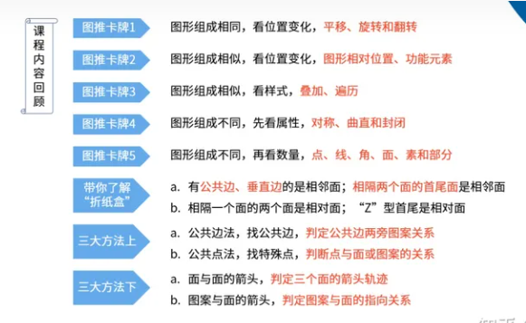

数字推理技巧总结：

备考规律一：等差数列及其变式
(后一项与前一项的差 d 为固定的或是存在一定规律(这种规律包括等差、等比、正负号交叉、正负号隔两项交叉等)
(1) 后面的数字与前面数字之间的差等于一个常数。如 7，11，15，( 19 )
(2）后面的数字与前面数字之间的差是存在一定的规律的，这个规律是一种等差的规律。如 7，11，16，22，( 29 )
(3) 后面的数字与前面数字之间的差是存在一定的规律的，但这个规律是一种等比的规律。如 7，11，13，14，( 14.5 )
(4）后面的数字与前面数字之间的差是存在一定的规律的，但这个规律是一种正负号进行交叉变换的规律。【例题】7，11，6，12，( 5 )
(5) 后面的数字与前面数字之间的差是存在一定的规律的，但这个规律是一种正负号每“相隔两项”进行交叉变换的规律。

备考规律二：等比数列及其变式
(后一项与除以前一项的倍数 q 为固定的或是存在一定规律(这种规律包括等差、等比、幂字方等)
（1）“后面的数字”除以“前面数字”所得的值等于一个常数。
【例题】4，8，16，32，( 64 )
（2）后面的数字与前面数字之间的倍数是存在一定的规律的，倍数加 1。
【例题】4，8，24，96，( 480 )
（3）后面的数字与前面数字之间的倍数是存在一定的规律的，倍数乘 2
【例题】4，8，32，256，( 4096 )
（4）后面的数字与前面数字之间的倍数是存在一定的规律的，倍数为 3 的 n
次方。
【例题】2，6，54，1428，( 118098 )
（5）后面的数字与前面数字之间的倍数是存在一定的规律的，“倍数”之间形
成了一个新的等差数列。
【例题】2，-4，-12，48，(240 )

备考规律三： “平方数”数列及其变式
(an=n2+d,其中 d 为常数或存在一定规律)
(1)“平方数”的数列
【例题】1，4，9，16，25，（36 ）
(2) 每一个平方数减去或加上一个常数
【例题】0，3，8，15，24，（35 ）
【例题变形】2，5，10，17，26，（37 ）
(3) 每一个平方数加去一个数值，而这个数值本身就是有一定规律的。（先抽丝剥茧）
【例题】2，6，12，20，30，（42 ）

备考规律四：“立方数”数列及其变式
(an=n3+d,其中 d 为常数或存在一定规律)
（1）“立方数”的数列【例题】8，27，64，( 125 )
（2）“立方数”的数列，其规律是每一个立方数减去或加上一个常数
【例题】7，26，63，(124 )
【例题变形】9，28，65，( 126 )
(3)每一个立方数加去一个数值，，而这个数值本身就是有一定规律的。
【例题】9，29，67，( 129 )

备考规律五：求和相加、求差相减、求积相乘、求商相除式的数列
(第三项等于第一项与第二项的运算结果，或者相差一个常量，或者相差一定的规律)
第一项与第二项相加等于第三项【例题】56，63，119，182，(301)
第一项减去第二项等于第三项【例题】8，5，3，2，1，( 1 )
第一项与第二项相乘等于第三项【例题】3，6，18，108，(1944)
第一项除以第二项等于第三项【例题】800，40，20，2，(10)

备考规律六：“隔项”数列
(1) 相隔的一项成为一组数列，即原数列中是由两组数列结合而成的。
【例题】1，4，3，9，5，16，7，（ 25 ）

备考规律七：混合式数列
【例题】1，4，3，8，5，16，7，32，( 9 )，（ 64 ）将来数字推理的不断演变，有可能出现 3 个数列相结合的题型，即有可能出现要求考生填写 3 个未知数字的题型。所以大家还是认真总结这类题型。
【例题变形】1，4，4，3，8，9，5，16，16，7，32，25，( 9 )， （ 64 ），（ 36 ）

一.数字逻辑 1.整数数列
整数数列一般有这几种题型：
• 差值固定，例：1，3，5，7，9，差值为 2 • 差值为连续质数，例：1，3，6，11，18，差值为 2，3，5，7
• 平方递增（牢记 1-20 的平方），例：1，4，9，16，25
• 立方递增（牢记 1~20 的立方这个好难啊，先插入一个平方试试），例：1，8，27，64，125

1
2
3
4
5
6
7
8
9
10
11
12
13
14
平方：1-121 就不说了
12*12=144
13*13=169
14*14=196
15*15=225
16*16=256
17*17=289
18*18=324
19*19=361
立方：
1 1 2 8 3 27 4 64 5 125
6 216 7 343 8 512 9 729 10 1000
11 1331 12 1728 13 2197 14 2744 15 3375
16 4096 17 4913 18 5832 19 6859 20 8000
开方递减，例：16、4、2、1
列数较小时，且较分散，尝试几项数字做和或做积，例：2，3，2， 5，6，其中（2+6）/4=（3+5）/4=2 【这个难】
数列变化较大时，常为递推数列，例:1，2，9，121，（9+121）^2 2.分数数列

分数个数>整数个数：约分、通分、反约分、前后项做差或做积
分数个数<整数个数：数列具有单调性时，考虑等比数列；如果数列两头大，中间小（中间小，两头大），考虑次方关系：4,2,2,4,16,其中关系为后一数位依次是前一位数的 1/2 次方、1 次方、2 次方，4 次方
注：数列无明显规律时，可做差寻找差值的关系（可能差值的差值具有规律），或尝试分奇数项偶数项找规律；
二.图形逻辑
图形相同看位置：平移（移动方向和距离）、旋转（正时针、逆时针）、翻转 主要有平移、旋转和翻转，其中翻转又包括上下、左右翻转

图形相似看样式：遍历（每行\每列具有相同组成元素，但顺序不同）
如果图形中的元素相似（有同有异），那我们可以考虑图形变换中发生了叠加。叠加的方式有很多种，比如直接叠加、去同存异、去异存同、规律叠加等，需要针对不同图形具体区分，同时观察角度也不限于行、列，也有可能需要看整体、交替看（图形变化间隔相同，比如依次由曲线、直线、曲线、直线……构成）
元素相似。题干各图形元素呈现相似的特征，在元素个数上可能存在差异，则可以考虑图形的样式(缺什么补什么)、组合叠加(直接叠加、加减同异、黑白叠加)。

图形杂乱看数量和属性：
一般常见的点、角、线、面等数量关系
明显的对称图形看对称轴的方向位置
线线接触时数交点或顶点个数 线线交点、线面切点
线又分为曲线和直线，题目中时常需要区分看待，另外还需注意的是图形的笔画。
线多时数线条数量
有明显区域划分时数封闭区间数量
有扇形时或棱角分明时数角数量
图形推理中与角相关较常出现的是对锐、直、钝角个数的观察以及它们之间变化规律的考察
遇到与汉字相关的题目时，我们可以从汉字的笔画数是否存在变化、汉字的结构特征（左右、上下、包围、半包围）、部分数（是否存在连接点）、封闭区域数（口、又、及……）进行突破。
和字母有关的突破点可以是直曲性、封闭空间、对称性、开口数、排列顺序等，偶尔也会出现字母镂空、剪影相关的图形题。
注：有钟表指针时，考虑指针对应时间的关系；
【总结】：分辨一个优先级，简单关系排一排，数量关系算一算，最后数一数。

1、元素凌乱。题干中各图形元素凌乱，几乎没有相同点，优先考虑数量关系的考点，规律的出发点可以是：点、线、角、面、素。元素凌乱除了考查图形的数量关系外，还可能考的是图形的属性，即几何特征。
点：交点和切点
线：图形的曲线和直线
角：180 度以内的直角和外角
面：封闭区间
素：元素的种类和个数

2、元素相同。题干图形中所包含的元素个数与种类相同，优先考虑图形的位置变化，包括图形中元素的平移、旋转以及翻转。

3、元素相似。题干各图形元素呈现相似的特征，在元素个数上可能存在差异，则可以考虑图形的样式(缺什么补什么)、组合叠加(直接叠加、加减同异、黑白叠加)。

4、空间折叠。空间折叠题最重要的是分析图形的相邻面和相对面，可以通过移动的方式找准各面之间的关系，根据“相对面只能看到其中一个、相邻面看公共边”的特征选择正确答案。

